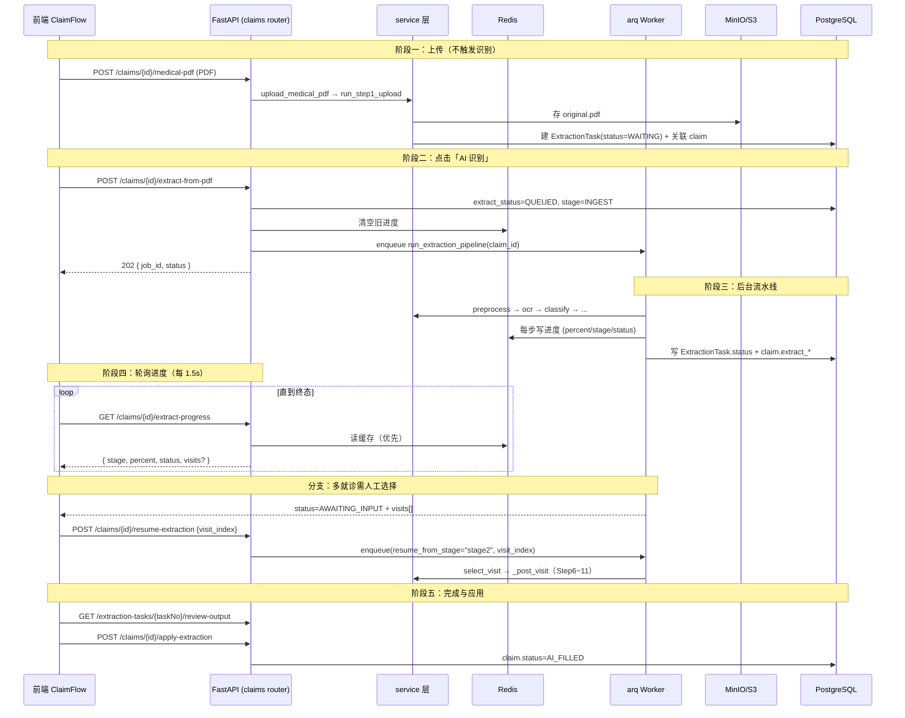

# 病历 PDF 智能识别 · 后台业务逻辑说明

> 面向：后端 / 全栈开发、运维。
> 范围：医生在填报流程中「上传病历 PDF → 点击 AI 识别」后，后端从入队到生成可核对结果的完整链路。
> 代码根目录：`apps/api`（FastAPI + arq + SQLAlchemy），前端 `apps/web`。

---

## 1. 一句话概览

医生上传 PDF 时只创建任务、存文件，**不做识别**；点击「AI 识别」后接口把任务**入队到 arq worker**（返回 HTTP 202），worker 在后台按 11 个 step 串行执行（预处理 → OCR/解析 → 分类 → 就诊检测 → 提取 → 校验 → 缺失检测 → 保司映射 → 生成核对数据），进度实时写入 Redis，前端每 1.5 秒轮询；遇到多就诊会暂停等待用户选择再续跑；完成后前端拉取核对结果供医生确认。

---

## 2. 端到端时序



---

## 3. 阶段一：上传病历 PDF

### 3.1 接口

| 项 | 内容 |
|---|---|
| 路由 | `POST /api/doctor/claims/{claim_id}/medical-pdf` |
| 定义 | `apps/api/src/modules/claims/router.py` |
| Service | `upload_medical_pdf()` → `apps/api/src/modules/claims/service.py` |
| Step 实现 | `run_step1_upload()` → `apps/api/src/modules/pdf_extraction/steps/step1_upload.py` |
| 前置条件 | `claim.status == "DRAFT"` |

### 3.2 调用链

```
upload_claim_medical_pdf (router)
  └─ service.upload_medical_pdf
       ├─ _clear_claim_medical_extraction()   # 若已存在旧任务，先清理
       └─ pdf_extraction_service.create_upload_task
            └─ run_step1_upload
```

### 3.3 Step1 做了什么

1. **校验 PDF**：仅 `.pdf`、非空、≤ 20MB、魔数以 `%PDF` 开头。
2. **生成任务号**：`EXT{YYYYMMDD}{8位hex}`。
3. **存储原件**：上传到对象存储，key 为
   `medical-records/{clinic_id}/{task_no}/original.pdf`。
4. **落库**：新建 `ExtractionTask`，`status=WAITING`、`current_step=STEP1_UPLOAD`；
   回填 `claim.extraction_task_id`、`claim.patient_name`。

> 上传阶段**只建任务、存文件**：不创建分页/OCR 子表，不入队 arq。任务停在 `WAITING`，等待用户点击「AI 识别」。

### 3.4 对象存储约定

| 产物 | Key 模式 |
|---|---|
| 原始 PDF | `medical-records/{clinic_id}/{task_no}/original.pdf` |
| 扫描页 PNG（Paddle 模式） | `.../{task_no}/pages/page-{n}.png` |
| MinerU Markdown | `.../{task_no}/parsed/content.md` |

- 走 boto3 **S3 协议**，默认指向 MinIO（`http://localhost:9000`）。
- 私有桶通过 API 的 `/local-storage/{key}` 代理访问。
- 存储不可用直接抛错，无本地磁盘降级。实现见 `apps/api/src/utils/storage.py`。

---

## 4. 阶段二：点击「AI 识别」→ 入队

### 4.1 前端 API 映射

文件：`apps/web/lib/claim/extraction.ts`

| 前端函数 | HTTP 请求 |
|---|---|
| `startClaimExtractFromPdf(claimId)` | `POST /api/doctor/claims/{id}/extract-from-pdf` |
| `resumeClaimExtraction(claimId, visitIndex)` | `POST /api/doctor/claims/{id}/resume-extraction` |
| `fetchClaimExtractProgress(claimId)` | `GET /api/doctor/claims/{id}/extract-progress` |

### 4.2 `start_extract_from_pdf`（`claims/service.py`）

1. 校验：`claim.status == DRAFT`、已有 `extraction_task_id`、当前非 `RUNNING/QUEUED`。
2. 初始化进度字段：`extract_status=QUEUED`、`extract_stage=INGEST`、`extract_progress=0`、`extract_message="任务已入队"`、`extract_manifest=None`。
3. 清空 Redis 旧进度：`clear_extraction_progress_cached(claim_id)`。
4. 入队：`enqueue_extraction_pipeline(claim_id)`，记录 `extract_job_id`。
5. 路由返回 **HTTP 202** + `{ job_id, status }`。

### 4.3 入队实现（`apps/api/src/tasks/queue.py`）

```python
async def enqueue_extraction_pipeline(submission_id, *, resume_from_stage=None, visit_index=None):
    job_id = await _enqueue("run_extraction_pipeline", submission_id, resume_from_stage, visit_index)
    if job_id is None:                      # Redis 不可用
        await run_extraction_pipeline(None, submission_id, resume_from_stage, visit_index)
    return job_id
```

- 正常：任务进 Redis 队列，由 worker 消费；`extract_status` 保持 `QUEUED`。
- **降级**：Redis 不可用时，在 API 进程内**内联同步执行**整条 pipeline，`extract_status` 直接置为 `RUNNING`。

### 4.4 Worker 配置（`apps/api/src/tasks/worker.py`）

- 注册函数：`run_extraction_pipeline`（及模板解析、AI 辅助等）。
- 启动命令：`arq src.tasks.worker.WorkerSettings`。
- `job_timeout = max(1200, MINERU_TIMEOUT_S + 600)`（应对 MinerU 长耗时解析）。
- Paddle 模式下 `worker_startup` 预热 OCR 引擎池；MinerU 模式跳过。

> 注意：`pdf_extraction/router.py` 下的逐步 `POST` 接口是**手动逐步调试通道**，不会自动入队 worker。填报流程的自动编排只发生在 `run_extraction_pipeline` 内。两者共用同一套 `pdf_extraction/service.py` 内核。

---

## 5. 阶段三：后台流水线编排

编排入口：`apps/api/src/tasks/extraction_pipeline_task.py` → `run_extraction_pipeline(ctx, submission_id, resume_from_stage, visit_index)`。

### 5.1 两条执行路径

| 路径 | 触发条件 | 行为 |
|---|---|---|
| **续跑** | `resume_from_stage == "stage2"` | `select_visit(visit_index)` → `_post_visit`（Step6~11） |
| **全量** | 默认 | 读 `ExtractionTask.status`，从当前状态往后推进 Step2~11 |

### 5.2 全量编排（状态驱动 + 进度百分比）

编排以 `ExtractionTask.status` 作为「推进到哪一步」的依据，每步执行前更新 claim 进度并写 Redis：

| 触发状态 | 动作 | stage | percent | message |
|---|---|---|---|---|
| `REVIEW`/`COMPLETED` | 直接判定完成 | DONE | 100 | 提取完成 |
| `WAITING` | `run_preprocess` | INGEST | 8 | PDF 预处理中 |
| `OCR`/`PREPROCESSING` | `run_ocr`（或跳过） | INGEST | 25 | OCR/MinerU/文本层解析中 |
| `CLASSIFYING` | `run_classify` | CLASSIFY | 45 | 文档分类中 |
| `VISIT_SELECT` | `_maybe_pause_for_visit` | CLASSIFY / AWAITING_INPUT | 55 / 58 | 就诊检测 / 请选择就诊 |
| `EXTRACTING`~`REVIEW` | `_post_visit` | EXTRACT→VALIDATE→DONE | 65→100 | 见下表 |

`_post_visit` 内部（Step6~11）：

| 步骤 | stage | percent | message |
|---|---|---|---|
| `run_build_prompt` | EXTRACT | 65 | AI 提取准备中 |
| `run_extract_fields` | EXTRACT | 75 | AI 字段提取中 |
| `run_finalize_extraction`（Step8~10） | VALIDATE | 88 | 字段校验与映射中 |
| `run_prepare_review` | VALIDATE | 95 | 生成核对数据中 |
| 完成 | DONE | 100 | 提取完成 |

### 5.3 多就诊断点（`_maybe_pause_for_visit`）

- 分类判定 `need_visit_selector == False` → 不暂停，继续。
- 检测出 visits：
  - **1 个** → 自动 `select_visit`，继续。
  - **多个且均未选中** → claim 置 `AWAITING_INPUT`（percent=58），把 visits 写入 `extract_manifest`，**worker 返回并等待**。
  - 已有 selected → 继续。

### 5.4 失败处理

任一 step 抛异常 → claim 置 `FAILED`、`progress=0`、`message="提取失败：{截断错误}"`，同步写 Redis 与 DB，然后 `raise`（arq 记录失败）。

---

## 6. 流水线各 Step 详解

业务实现集中在 `pdf_extraction/service.py`；`steps/stepN_*.py` 是可单测的纯逻辑模块。

| Step | 名称 | 输入 | 处理要点 | 输出（DB） | AI |
|---|---|---|---|---|---|
| 1 | Upload | PDF bytes | 校验/存储/建任务 | `extraction_task` | 无 |
| 2 | Preprocess | 原始 PDF | PyMuPDF 逐页：文本≥20字符→`text_layer`，否则 300DPI 转 PNG→`ocr_required`；MinerU 模式仅记录页数 | `document_page` | 无 |
| 3 | OCR / 解析 | 分页 | Paddle：扫描页并行 OCR；MinerU：整份 PDF→Markdown→blocks | `ocr_result` | OCR 引擎 |
| 4 | Classify | OCR 文本（前 5 页 / ≤12000 字） | 判定文档类型、语言、保司、是否多病人/多就诊 | `document_classification` | Gemini |
| 5 | Detect Visits + Select | 前 20 页 / ≤24000 字 + 分类 | 检测多次就诊；选择后清理下游产物 | `extraction_visit` | Gemini |
| 6 | Prompt Builder | 分类/就诊页范围/OCR 文本/标准字段 schema | 拼装提取 prompt（含规则与字段契约） | `extraction_prompt` | 无 |
| 7 | Field Extract | prompt + 目标字段 | 调 Gemini 提取，含限流 | `extraction_result`（stage=raw） | Gemini |
| 8 | Validate | raw fields | 日期/HKID/金额/枚举/ICD-10/CPT 标准化校验 | `extraction_result`（stage=validated） | 无 |
| 9 | Detect Missing | validated fields + schema | 补齐缺失字段，空值/占位标 `missing` | `extraction_result`（stage=final） | 无 |
| 10 | Insurance Mapper | final fields + 保司/模板映射 | 映射到保司字段（优先 DB 模板，fallback 内置） | `extraction_mapped_result` | 无 |
| 11 | Review Output | final fields + OCR 溯源 | 生成全字段核对 JSON（含页码/bbox/原文溯源） | `extraction_review_output` | 无 |

关键约束（与 `EXTRACTION_PRINCIPLES.zh-CN.md` 一致）：每个标准字段都带 `value / status(extracted|missing|low_confidence) / confidence / source`；无依据一律 `missing`，禁止编造/跨就诊搬运；干扰项（积分、网络代码、预约编号等）不得进入字段。

---

## 7. AI 服务调用

### 7.1 Gemini 模型与 Location

配置：`apps/api/src/config.py`；默认值见根目录 `.env`。

| 用途 | 实现类 | 模型（默认） | Location（默认） |
|---|---|---|---|
| Step4 文档分类 | `GeminiDocumentClassifier` | `gemini-2.5-flash` | `europe-west2` |
| Step5 就诊检测 | `GeminiVisitDetector` | `gemini-2.5-flash` | `europe-west2` |
| Step7 字段提取 | `GeminiFieldExtractor` | `gemini-3.1-pro-preview` | `global` |

- Vertex AI 客户端：`get_gemini_client(location)`（`modules/ai_extraction/gemini_client.py`）。
- 需要 `GCP_PROJECT_ID` 与 `GOOGLE_APPLICATION_CREDENTIALS`。
- **降级**：本地环境或 `GEMINI_STUB_ON_ERROR=true` 时，AI 失败返回 stub（分类 Unknown、就诊 stub、字段全 `missing`），保证流程不中断。见 `ai_service/fallback.py`。

### 7.2 非 Gemini 组件

| 组件 | 路径 | 用途 |
|---|---|---|
| PaddleOCR | `ocr_service/paddle_engine.py` | 扫描页 OCR（`lang=ch`） |
| OCR 引擎池 | `ocr_service/engine_pool.py` | 多实例并发，避免共享单引擎 |
| MinerU | `document_parser/mineru_parser.py` | PDF→Markdown（CLI `mineru` 或 `MINERU_API_URL`） |

解析器切换：`.env` 中 `DOCUMENT_PARSER=paddle|mineru`（当前默认 `mineru`）。

---

## 8. 任务状态机（双层）

### 8.1 `ExtractionTask.status`（流水线粒度）

定义：`pdf_extraction/schemas.py`

```
WAITING → PREPROCESSING → OCR → CLASSIFYING → VISIT_SELECT
  → EXTRACTING → VALIDATING → MAPPING → REVIEW → COMPLETED
  └─ FAILED（任意 step 失败）
```

- `current_step`：更细粒度，如 `STEP2_PREPROCESS_DONE`、`STEP7_EXTRACT_FIELDS_DONE`…
- `ExtractionResult.stage`：`raw → validated → final`。

### 8.2 `ClaimSubmission.extract_*`（UI / 编排粒度）

模型：`apps/api/src/db/models/claims.py`

| 字段 | 取值 |
|---|---|
| `extract_status` | `IDLE` / `QUEUED` / `RUNNING` / `AWAITING_INPUT` / `DONE` / `FAILED` |
| `extract_stage` | `IDLE` / `INGEST` / `CLASSIFY` / `EXTRACT` / `VALIDATE` / `AWAITING_INPUT` / `DONE` / `FAILED` |
| `extract_progress` | 0–100 |
| `extract_message` | 人类可读文案 |
| `extract_manifest` | 多就诊时 `{ task_no, visits: [...] }` |
| `extract_job_id` | arq job id |

### 8.3 Claim 业务状态（独立于上面两层）

```
DRAFT → AI_FILLED → CONFIRMED → PRINTED
```

`apply-extraction` 成功后才从 `DRAFT` 进入 `AI_FILLED`。

### 8.4 三层对应关系

| Worker 阶段 | claim.extract_stage | ExtractionTask.status |
|---|---|---|
| 预处理 / OCR | INGEST | PREPROCESSING / OCR |
| 分类 / 就诊 | CLASSIFY | CLASSIFYING / VISIT_SELECT |
| 提取 | EXTRACT | EXTRACTING |
| 校验 / 映射 / 生成核对 | VALIDATE | VALIDATING / MAPPING / REVIEW |
| 完成 | DONE | REVIEW（review 已生成） |
| 等待选就诊 | AWAITING_INPUT | VISIT_SELECT |

---

## 9. 进度反馈机制

### 9.1 写入（三处）

1. **Redis（实时）**：`report_extraction_progress()`，key `claim_extract_progress:{claim_id}`，TTL 600s，结构 `{percent, message, stage, status}`。实现见 `apps/api/src/tasks/extraction_progress.py`。
2. **PostgreSQL（持久兜底）**：`claim_submission.extract_*` 字段。
3. **ExtractionTask**：各 step 更新 `status` + `current_step`（产物驱动）。

### 9.2 读取（`claims/service.py` → `get_extract_progress`）

优先级：

1. 无 `extraction_task_id` → `{ status: IDLE, message: "请先上传病历 PDF" }`。
2. `extract_status ∈ {RUNNING, QUEUED}` 且 Redis 有非终态缓存 → **返回 Redis**（低延迟）。
3. 特例：`IDLE/QUEUED` 但 task 已是 `REVIEW` → 返回 `DONE 100%`。
4. 否则读 DB `extract_*`；`AWAITING_INPUT` 时附带 `visits`（取自 `extract_manifest`）。

### 9.3 前端轮询（`useClaimExtractionPipeline.ts`）

- 间隔 **1500ms**。
- 终态：`DONE` / `FAILED` / `AWAITING_INPUT`。
- `DONE` 后：拉 `GET /extraction-tasks/{taskNo}/review-output`，并弹出「AI 识别完成，耗时 X 秒」提示（2 秒自动消失）。
- `AWAITING_INPUT`：弹出就诊选择框，选完调 `resume-extraction`。

> 区分：`parse_progress.py`（key `template_parse_progress:{template_id}`）服务于**保单模板解析**，与病历提取无关；病历提取进度用 `extraction_progress.py`。

---

## 10. 阶段五：完成与应用到理赔单

1. 流水线在 Step11 生成 `extraction_review_output`（`standard_fields` + `mapped_fields`，`is_confirmed=false`）。
2. 前端展示可编辑的核对表单，医生修改置信度偏低 / 缺失字段。
3. 医生确认 → `POST /api/doctor/claims/{id}/apply-extraction`：
   - 读取 `ExtractionReviewOutput`，合并医生编辑；
   - 写入 `claim.ai_raw_result` / `final_field_values`；
   - `claim.status` → `AI_FILLED`。

---

## 11. 关键设计要点

1. **双入口、单内核**：填报流程走 arq worker 自动编排；`extraction-tasks/*` 走手动逐步调试，共用 `pdf_extraction/service.py`。
2. **产物驱动幂等**：各 step 先查 DB 产物，已存在则跳过重算（见 `artifact_gates.py`），支持中断续跑。
3. **人机协同断点**：多就诊时 worker 内暂停 → `AWAITING_INPUT` + manifest → 续跑参数 `resume_from_stage="stage2"`。
4. **Redis 可选**：不可用时 API 进程内联执行完整 pipeline（`extract_status=RUNNING`）。
5. **理赔安全约束**：Step6 prompt + Step7 Gemini + Step8/9 本地规则共同落实「如实提取 / 如实缺失 / 剔除干扰 / 绑定正确」。

---

## 12. 关键文件索引

| 职责 | 路径 |
|---|---|
| 填报路由 | `apps/api/src/modules/claims/router.py` |
| 填报服务 | `apps/api/src/modules/claims/service.py` |
| 提取内核（step 编排） | `apps/api/src/modules/pdf_extraction/service.py` |
| 逐步调试路由 | `apps/api/src/modules/pdf_extraction/router.py` |
| Worker 编排任务 | `apps/api/src/tasks/extraction_pipeline_task.py` |
| 入队 | `apps/api/src/tasks/queue.py` |
| Worker 配置 | `apps/api/src/tasks/worker.py` |
| 提取进度（Redis） | `apps/api/src/tasks/extraction_progress.py` |
| Step1 上传 | `apps/api/src/modules/pdf_extraction/steps/step1_upload.py` |
| 各 Step 逻辑 | `apps/api/src/modules/pdf_extraction/steps/stepN_*.py` |
| AI 服务 | `apps/api/src/modules/pdf_extraction/ai_service/` |
| 文档解析（MinerU） | `apps/api/src/modules/pdf_extraction/document_parser/` |
| OCR 服务 | `apps/api/src/modules/pdf_extraction/ocr_service/` |
| DB 模型 | `apps/api/src/db/models/extraction.py`、`.../claims.py` |
| 状态 / schema | `apps/api/src/modules/pdf_extraction/schemas.py` |
| 对象存储 | `apps/api/src/utils/storage.py` |
| 前端 API 封装 | `apps/web/lib/claim/extraction.ts` |
| 前端轮询 Hook | `apps/web/components/extraction/useClaimExtractionPipeline.ts` |
